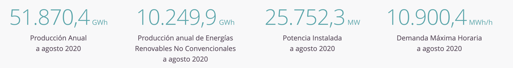
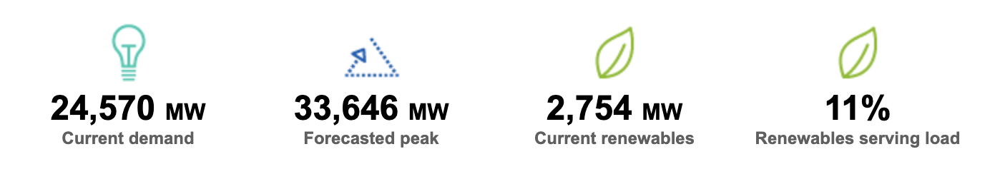

# CEN-Chile

Prueba de la API del Coordinador Eléctrico Nacional. 
En este repositorio esta la utilización de la API del Coordinador Eléctrico Nacional de Chile.

La meta es lograr a través de la información entragada por la API, desplegar con github actions y actualizar la información cada 3 horas y desplegarla en este README.

### CEN: Operador nacional Chile

### CAISO: Operador de California

<h3>Herramientas utilizadas</h3>

  
  
  

